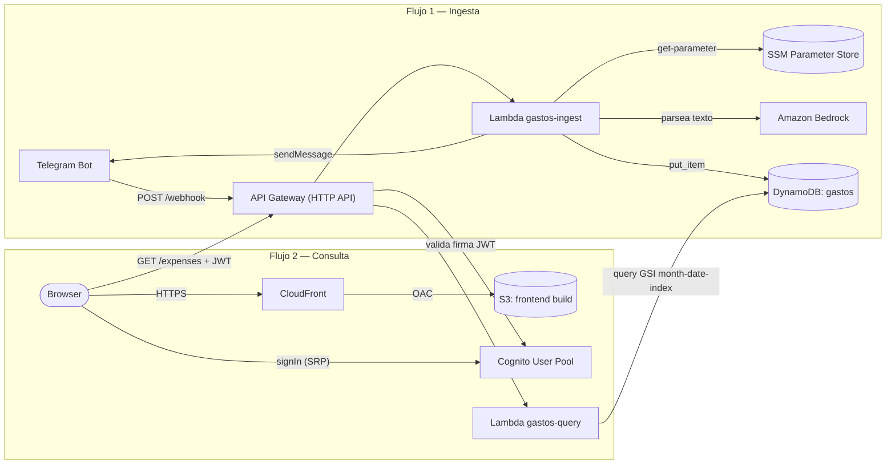
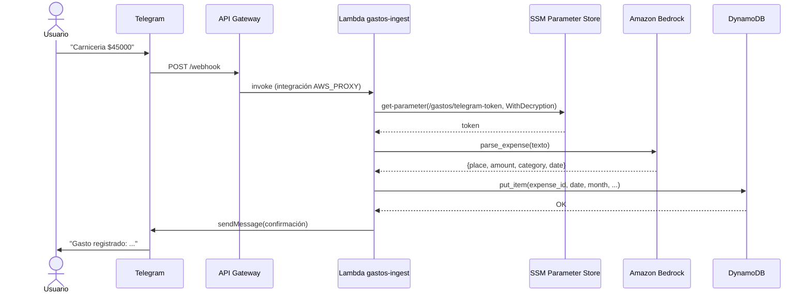
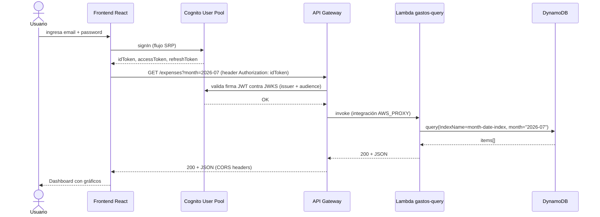
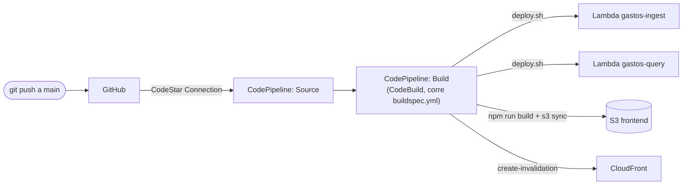

# gastos-bot

Bot de gastos personales. Registrás gastos escribiéndole a un bot de Telegram en lenguaje natural, y los visualizás en un frontend React con gráficos por categoría y por día.

---

## Arquitectura general



Dos flujos independientes: uno para **ingestar** datos desde Telegram, otro para **consultarlos** desde el browser (este último requiere login con Cognito). Comparten la misma API Gateway (rutas distintas) y la misma tabla DynamoDB.

---

## Flujo 1 — Cargar un gasto via Telegram

1. El usuario escribe en Telegram, ej: `"Carniceria $45000"`
2. Telegram hace un HTTP POST al webhook configurado en API Gateway
3. API Gateway invoca la Lambda `gastos-ingest`
4. La Lambda recupera el token de Telegram desde SSM Parameter Store
5. Le pasa el texto a Amazon Bedrock, que extrae lugar, monto, categoría y fecha
6. Guarda el ítem en DynamoDB
7. Responde al usuario con confirmación en el chat de Telegram



## Flujo 2 — Ver gastos en el frontend

1. El usuario abre el browser en `http://localhost:5173` y ve la pantalla de login
2. Inicia sesión contra el User Pool de Cognito (`signIn` de `aws-amplify/auth`, flujo SRP)
3. React hace `GET /expenses?month=YYYY-MM` a API Gateway, adjuntando el JWT (`idToken`) en el header `Authorization`
4. API Gateway valida el JWT con un Cognito JWT Authorizer antes de invocar la Lambda
5. API Gateway invoca la Lambda `gastos-query`
6. La Lambda hace un `query` sobre el GSI `month-date-index` en DynamoDB (o `scan` completo si no se pasa `month`)
7. Devuelve el array JSON de gastos
8. React renderiza dashboard con gráficos o tabla de listado



---

## IAM — mínimo privilegio

`gastos-lambda-role` es el rol compartido por `gastos-ingest` y `gastos-query`. En vez de policies AWS-managed genéricas (`AmazonSSMReadOnlyAccess`, `AmazonDynamoDBFullAccess`, `AmazonBedrockFullAccess` — acceso a *toda* la cuenta), usa una policy custom (`gastos-lambda-policy`) acotada a los recursos exactos:

| Servicio | Acción | Recurso |
|---|---|---|
| SSM | `GetParameter` | Solo `/gastos/telegram-token` |
| KMS | `Decrypt` | Solo la key usada por SSM, y solo si el request viene *vía* el servicio SSM (`kms:ViaService`) |
| DynamoDB | `PutItem`, `GetItem`, `Query`, `Scan` | Solo tabla `gastos` + índice `month-date-index` (nada de `DeleteTable`/`UpdateTable`, ni otras tablas) |
| Bedrock | `InvokeModel` | Solo los modelos puntuales (Nova Micro, Claude 3 Haiku) — nada de administración |

Se mantiene `AWSLambdaBasicExecutionRole` (managed) para logs de CloudWatch, ya que esa sí está razonablemente acotada por diseño.

**Por qué un solo rol compartido y no uno por función:** `gastos-query` en rigor no necesita SSM/Bedrock/`PutItem`, y `gastos-ingest` no necesita `Query`/`Scan`. Separar sería más purista, pero `deploy.sh` asume un único rol hardcodeado y es un proyecto de un solo usuario — el salto de seguridad real (eliminar los `*FullAccess`) ya está hecho con el rol compartido acotado.

---

## Auditoría de seguridad (2026-07-07)

Revisión completa: secretos en repo, exposición de S3/CORS/Lambda URLs, permisos IAM, MFA, y logging de auditoría. Resultado:

**Sin hallazgos** en: secretos hardcodeados, bucket S3 del frontend (Public Access Block completo, ACL privada), CORS (whitelist explícita, sin `*`), Lambda Function URLs (no existen, todo pasa por API Gateway + JWT Authorizer), encryption at rest de DynamoDB (AWS owned key, automático), permisos de `wallyadmin` (vía grupo IAM, no policies directas).

**2 correcciones aplicadas:**
1. **Cognito MFA** estaba en `OFF` (debía quedar `OPTIONAL`, por un desajuste entre lo acordado y lo ejecutado al crear el User Pool). Corregido a `OPTIONAL` con TOTP habilitado — SMS queda deshabilitado a propósito para no generar costo por mensaje.
2. **CloudTrail**: no había ningún trail configurado, solo el Event History gratuito de 90 días. Se creó `gastos-bot-trail` (multi-región, management events, log file validation habilitado), con su propio bucket S3 privado (`gastos-bot-cloudtrail-<account-id>`, Public Access Block + encryption AES256).

**Nota conceptual:** CloudTrail no previene acciones destructivas — eso ya lo cubren la Deletion Protection de DynamoDB y el IAM de mínimo privilegio de las Lambdas (que no tienen `DeleteTable`/`DeleteItem`). CloudTrail es auditoría/forense: sirve si las credenciales de `wallyadmin` se vieran comprometidas, para saber qué se hizo con ellas.

**Costo de estos cambios:** el trail de management events es gratis (1 por cuenta). El storage S3 de los logs generados sí se factura (no tiene free tier permanente), pero al volumen de esta cuenta es de fracciones de centavo por mes — no es una garantía de "$0 para siempre" como sí lo es el trail en sí.

---

## Estructura del repositorio

```
gastos-bot/
├── backend/
│   └── lambdas/
│       ├── ingest/              ← Lambda que recibe mensajes de Telegram
│       │   ├── handler.py       ← Entry point
│       │   ├── bedrock.py       ← Llama a Bedrock para parsear el mensaje
│       │   ├── dynamo.py        ← Guarda el gasto en DynamoDB
│       │   └── requirements.txt
│       └── query/               ← Lambda que expone los datos al frontend
│           ├── handler.py       ← Entry point, filtra por mes si se pasa ?month=
│           └── deploy.sh        ← Deploy completo: Lambda + API Gateway
└── frontend/                    ← App React + Vite
    ├── src/
    │   ├── App.jsx              ← Sesión (login/logout) + navegación entre páginas
    │   ├── amplifyConfig.js     ← Amplify.configure con Cognito (User Pool + Client)
    │   ├── services/api.js      ← fetch a API Gateway, adjunta JWT en Authorization
    │   ├── components/
    │   │   ├── MonthPicker.jsx  ← <input type="month">
    │   │   ├── StatCard.jsx     ← Tarjeta de KPI
    │   │   ├── CategoryPieChart.jsx  ← Torta por categoría
    │   │   └── DailyBarChart.jsx     ← Barras por día
    │   └── pages/
    │       ├── Login.jsx        ← Login con Cognito (sin signup, usuario único)
    │       ├── Dashboard.jsx    ← Resumen del mes
    │       └── ExpenseList.jsx  ← Tabla de gastos
    ├── package.json
    └── vite.config.js
```

---

## Infraestructura AWS

| Recurso | Referencia |
|---|---|
| API Gateway (HTTP API) | Ver variable `API_GATEWAY_ID` |
| Region | `us-east-1` (o la que uses) |
| Lambda ingest | `gastos-ingest` |
| Lambda query | `gastos-query` |
| IAM Role | `gastos-lambda-role` |
| DynamoDB tabla | `gastos` |
| SSM token Telegram | `/gastos/telegram-token` (SecureString) |
| SSM Cognito User Pool ID | `/gastos/cognito/user-pool-id` |
| SSM Cognito Client ID | `/gastos/cognito/client-id` |
| Cognito User Pool | Ver variable `COGNITO_USER_POOL_ID` |
| Cognito App Client | Sin secret (SPA), flujo `ALLOW_USER_SRP_AUTH` |
| Endpoint webhook | `https://<api-id>.execute-api.<region>.amazonaws.com/prod/webhook` |
| Endpoint expenses | `https://<api-id>.execute-api.<region>.amazonaws.com/prod/expenses` |

### Rutas API Gateway

| Método | Ruta | Lambda | Auth |
|---|---|---|---|
| POST | /webhook | gastos-ingest | Ninguna (Telegram no manda JWT) |
| GET | /expenses | gastos-query | Cognito JWT Authorizer |

CORS habilitado a nivel API (headers `Authorization`, `Content-Type`; métodos `GET`, `OPTIONS`) para el origen del frontend local. Si se agrega un dominio de producción (S3/CloudFront), hay que sumarlo a `AllowOrigins`.

---

## Modelo de dato DynamoDB

Tabla: `gastos`

| Campo | Tipo | Rol | Notas |
|---|---|---|---|
| expense_id | String | PK | uuid4 generado al guardar |
| date | String | SK | Formato YYYY-MM-DD |
| place | String | — | Lugar del gasto |
| amount | String | — | Float como string (ej: "45000.0") |
| currency | String | — | Siempre "ARS" |
| category | String | — | Ver categorías abajo |
| raw_message | String | — | Texto original del mensaje Telegram |

**Por qué amount es String y no Number?** Bedrock devuelve el monto como string, y DynamoDB tiene comportamientos impredecibles con precisión de floats. Se convierte a float en el frontend con `parseFloat()`.

**Categorías válidas:**
`ALIMENTACION, TRANSPORTE, SALUD, ENTRETENIMIENTO, HOGAR, ROPA, EDUCACION, RESTAURANTE, SERVICIOS, MASCOTAS, AUTOMOVIL, OTROS`

### GSI para filtro por mes

El filtro por mes (`GET /expenses?month=2026-07`) usa un GSI `month-date-index` (Partition Key `month`, Sort Key `date`), en vez de un `scan` completo con `FilterExpression`. El atributo `month` se deriva de `date[:7]` al guardar el gasto en `dynamo.py`.

El listado sin filtro (`GET /expenses`) sigue usando `scan` completo — no hay una forma más eficiente de traer todos los ítems sin filtrar, y no se justifica una solución más compleja para el volumen actual.

### Point-in-Time Recovery (PITR)

Habilitado, con 35 días de retención (el máximo del modo estándar). Permite restaurar la tabla a cualquier segundo dentro de esa ventana ante un borrado o corrupción accidental de datos — complementa (no reemplaza) la Deletion Protection, que solo evita borrar la tabla entera.

---

## Stack frontend

| Tecnología | Versión | Rol |
|---|---|---|
| React | 18 | UI |
| Vite | 5 | Bundler / dev server |
| Tailwind CSS | 3 | Estilos |
| Recharts | 2 | Gráficos SVG |

### Cómo funciona el estado

No hay Redux ni Context global. Cada página maneja su propio estado con `useState` y `useEffect`. El patrón es siempre el mismo:

```jsx
const [month, setMonth] = useState(currentMonth())   // "2026-07"
const [expenses, setExpenses] = useState([])
const [loading, setLoading] = useState(true)

useEffect(() => {
  getExpenses(month).then(setExpenses)
}, [month])  // se re-ejecuta cada vez que cambia el mes
```

Cuando el usuario cambia el mes en `MonthPicker`, `month` cambia, el `useEffect` se dispara, hace el fetch con el nuevo parámetro y React re-renderiza los componentes.

---

## Levantar el frontend en local

```bash
cd frontend/

# 1. Copiar y completar el archivo de entorno
cp .env.example .env
# Editar .env y poner la URL de tu API Gateway en VITE_API_BASE

# 2. Instalar dependencias (solo la primera vez)
npm install

# 3. Levantar dev server
npm run dev      # → http://localhost:5173
```

---

## Deploy

**Automático (recomendado):** cualquier push a `main` dispara el pipeline de CodePipeline, que deploya las 2 Lambdas y el frontend solo. Ver [Fase 5](#fase-5--cómo-quedó) más abajo.

**Manual (para debugging o correr un deploy suelto sin pushear):**

```bash
cd backend/lambdas/query/   # o backend/lambdas/ingest/

# Definir variables de entorno con tus IDs reales
export AWS_ACCOUNT_ID=<tu-account-id>
export API_GATEWAY_ID=<tu-api-gateway-id>
export MSYS_NO_PATHCONV=1   # necesario en Git Bash en Windows

bash deploy.sh
```

Ambos scripts (`query/deploy.sh` e `ingest/deploy.sh`) son idempotentes: detectan si la función/integración/ruta ya existen y solo actualizan lo necesario — son los mismos que corre el pipeline en `buildspec.yml`.

---

## Fases del proyecto

| Fase | Estado | Descripción |
|---|---|---|
| 1 | ✅ Completa | Bot Telegram + Lambda ingest + Bedrock + DynamoDB |
| 2 | ✅ Completa | API Gateway configurado, webhook activo |
| 3a | ✅ Completa | Lambda query deployada con endpoint /expenses |
| 3b | ✅ Completa | Frontend React deployado en S3 + CloudFront |
| 4 | ✅ Completa | Autenticación con AWS Cognito + Amplify JS SDK |
| 5 | ✅ Completa | CI/CD con CodePipeline + CodeBuild, deploy automático en cada push a `main` |

### Fase 3b — cómo quedó

1. Bucket S3 privado (`gastos-bot-frontend-<account-id>`), sin website hosting público ni acceso público directo
2. Distribución CloudFront con Origin Access Control (OAC) — solo CloudFront puede leer del bucket
3. Deploy: `npm run build` + `aws s3 sync dist/ s3://<bucket> --delete` (automatizado desde Fase 5, ver abajo)
4. Dominio de CloudFront agregado a `AllowOrigins` del CORS de API Gateway

### Fase 4 — cómo quedó

1. User Pool de Cognito, login por email (sin username separado)
2. App Client sin secret (SPA), flujo `ALLOW_USER_SRP_AUTH`
3. Pantalla de login propia en React (sin componente `Authenticator` de Amplify UI, sin signup — es un proyecto de un solo usuario, el usuario se crea vía `admin-create-user`)
4. `GET /expenses` protegido con un Cognito JWT Authorizer en API Gateway
5. El frontend adjunta el `idToken` en el header `Authorization` de cada request
6. CORS habilitado a nivel API para que el browser pueda mandar el header custom

### Fase 5 — cómo quedó



- `backend/lambdas/ingest/deploy.sh` — mismo patrón idempotente que `query/deploy.sh` (detecta si la Lambda/integración/ruta ya existen, actualiza en vez de duplicar)
- `buildspec.yml` en la raíz: 4 fases (`install` → `pre_build` → `build` → `post_build`), deploya las 2 Lambdas y sincroniza el frontend a S3 + invalida CloudFront
- Variables de config (API Gateway ID, bucket del frontend, distribution ID, IDs de Cognito) via `env.parameter-store` en SSM — nada hardcodeado en el `buildspec.yml`
- **CodeStar Connection** a GitHub — la autorización inicial requiere un clic manual en la consola (no es 100% automatizable por CLI)
- **CodePipeline tipo V2** — cobra por minuto de ejecución en vez del flat mensual de V1, más barato para uso esporádico como este
- Dos IAM roles de mínimo privilegio: uno para CodeBuild (acceso acotado a los recursos exactos que toca el build) y uno para CodePipeline (orquestación + la connection + el proyecto de CodeBuild)

**Deploy manual queda obsoleto:** ya no hace falta correr `npm run build` + `aws s3 sync` a mano — cualquier push a `main` dispara el pipeline solo.
