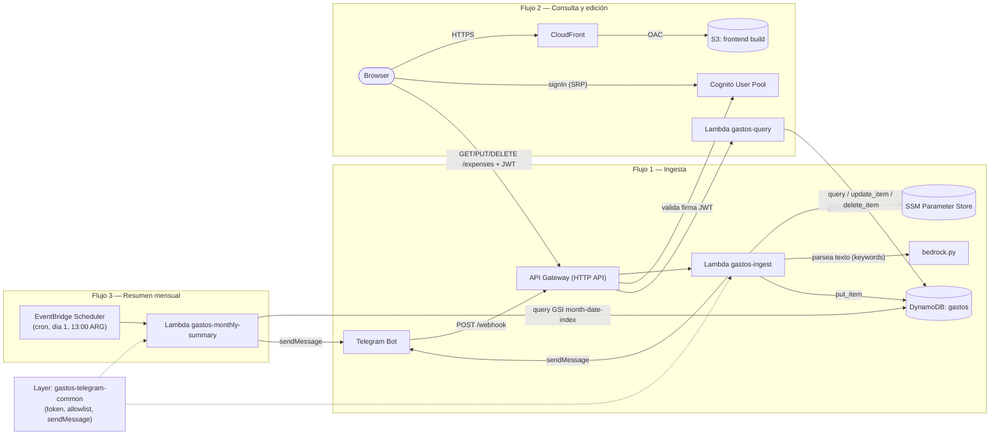
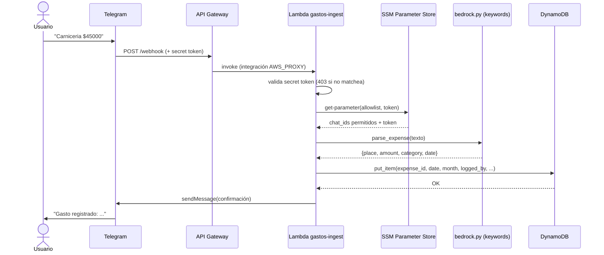
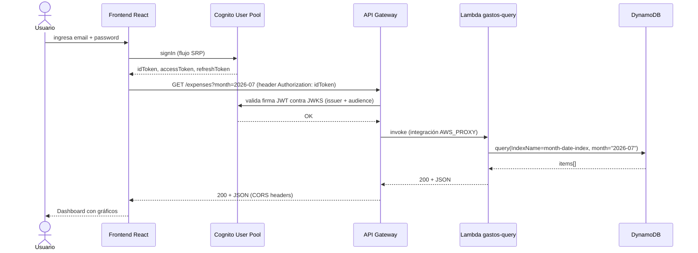
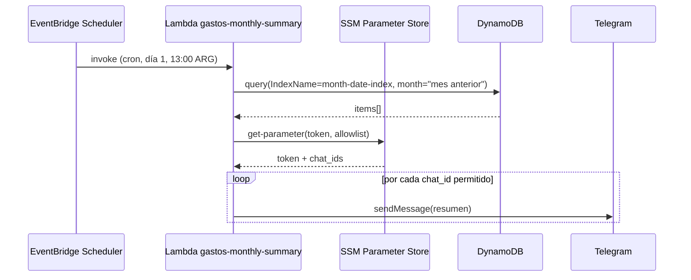
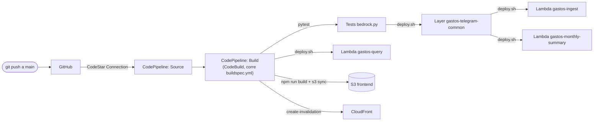

# gastos-bot

Bot de gastos personales. Registrás gastos escribiéndole a un bot de Telegram en lenguaje natural, y los visualizás en un frontend React con gráficos por categoría y por día.

---

## Arquitectura general



Tres flujos: **ingestar** datos desde Telegram, **consultar/editar/borrar** desde el browser (requiere login con Cognito), y un **resumen mensual automático** disparado por cron (no por HTTP). Los dos primeros comparten la misma API Gateway (rutas distintas); los tres comparten la misma tabla DynamoDB. `gastos-ingest` y `gastos-monthly-summary` comparten además un Lambda Layer (`gastos-telegram-common`) con el código para hablar con la API de Telegram — `gastos-query` no lo necesita porque nunca le escribe a Telegram.

---

## Flujo 1 — Cargar un gasto via Telegram

1. El usuario (o su pareja, desde un grupo compartido) escribe en Telegram, ej: `"Carniceria $45000"`
2. Telegram hace un HTTP POST al webhook configurado en API Gateway, incluyendo un secret token propio en el header `X-Telegram-Bot-Api-Secret-Token`
3. API Gateway invoca la Lambda `gastos-ingest`, que primero valida ese secret token (`hmac.compare_digest`) — si no coincide, corta con `403` antes de tocar nada más
4. Valida que el `chat_id` esté en el allowlist (`/gastos/telegram-allowed-chat-ids`); si no, ignora el mensaje en silencio
5. Le pasa el texto a `bedrock.py`, que extrae lugar y monto por regex (obliga un `$` explícito) y categoriza por palabras clave (`CATEGORY_KEYWORDS`) — **no es Amazon Bedrock real**, ver nota más abajo
6. Guarda el ítem en DynamoDB, incluyendo `logged_by` (quién de los dos lo cargó, según `message.from.first_name` de Telegram)
7. Responde al usuario con confirmación en el chat de Telegram



## Flujo 2 — Ver, editar y borrar gastos en el frontend

1. El usuario abre el browser y ve la pantalla de login
2. Inicia sesión contra el User Pool de Cognito (`signIn` de `aws-amplify/auth`, flujo SRP)
3. React hace `GET /expenses?month=YYYY-MM` a API Gateway, adjuntando el JWT (`idToken`) en el header `Authorization`
4. API Gateway valida el JWT con un Cognito JWT Authorizer antes de invocar la Lambda (mismo authorizer en `GET`, `PUT` y `DELETE`)
5. API Gateway invoca la Lambda `gastos-query`, que dispatchea según `event.requestContext.http.method`
6. `GET` hace un `query` sobre el GSI `month-date-index` (o `scan` completo sin `month`); `PUT` hace `update_item` sobre `place`/`amount`/`category` (la fecha no se puede editar, es la sort key); `DELETE` hace `delete_item`
7. Devuelve el resultado como JSON
8. React renderiza el dashboard con gráficos, o la tabla de listado con botones "Editar"/"Borrar" por fila



`PUT` y `DELETE` siguen el mismo patrón de autenticación (JWT Authorizer) — la diferencia está solo en el método HTTP y en qué hace `gastos-query` puertas adentro (`update_item` vs `delete_item` en vez de `query`). Ambos requieren `date` como query string param además de `expense_id` en el path, porque `date` es la sort key de la tabla.

## Flujo 3 — Resumen mensual automático

1. `EventBridge Scheduler` dispara el día 1 de cada mes a las 13:00 hora Argentina (timezone nativo del schedule, no UTC)
2. Invoca la Lambda `gastos-monthly-summary` — no hay ningún request HTTP de por medio, es el primer trigger basado en cron del proyecto
3. La Lambda calcula el mes que acaba de cerrar (resta un día al día 1 actual) y hace un `query` sobre el GSI `month-date-index`
4. Arma un texto con el total y el desglose por categoría
5. Manda el resumen por Telegram a todos los `chat_id` del allowlist



---

## IAM — mínimo privilegio

`gastos-lambda-role` es el rol compartido por `gastos-ingest`, `gastos-query` y `gastos-monthly-summary`. En vez de policies AWS-managed genéricas (`AmazonSSMReadOnlyAccess`, `AmazonDynamoDBFullAccess`, `AmazonBedrockFullAccess` — acceso a *toda* la cuenta), usa una policy custom (`gastos-lambda-policy`) acotada a los recursos exactos:

| Servicio | Acción | Recurso |
|---|---|---|
| SSM | `GetParameter` | Solo los parámetros de Telegram (`telegram-token`, `telegram-allowed-chat-ids`, `telegram-webhook-secret`) |
| KMS | `Decrypt` | Solo la key usada por SSM, y solo si el request viene *vía* el servicio SSM (`kms:ViaService`) |
| DynamoDB | `PutItem`, `GetItem`, `Query`, `Scan`, `UpdateItem`, `DeleteItem` | Solo tabla `gastos` + índice `month-date-index` (nada de `DeleteTable`/`UpdateTable`, ni otras tablas) |
| Bedrock | `InvokeModel` | Solo los modelos puntuales (Nova Micro, Claude 3 Haiku) — nada de administración. **Sin uso real hoy**, ver nota sobre Bedrock más abajo |

Se mantiene `AWSLambdaBasicExecutionRole` (managed) para logs de CloudWatch, ya que esa sí está razonablemente acotada por diseño.

**Por qué un solo rol compartido y no uno por función:** en rigor cada Lambda usa solo un subconjunto de estos permisos (`gastos-query` no necesita SSM/Bedrock/`PutItem`, `gastos-ingest` no necesita `Query`/`Scan`/`UpdateItem`, `gastos-monthly-summary` no necesita `PutItem`/`UpdateItem`/`DeleteItem`). Separar sería más purista, pero los `deploy.sh` asumen un único rol hardcodeado y es un proyecto de un solo usuario — el salto de seguridad real (eliminar los `*FullAccess`) ya está hecho con el rol compartido acotado.

**Otros roles de mínimo privilegio del proyecto** (no ejecutan código de Lambda, orquestan otros servicios):

| Rol | Quién lo asume | Para qué |
|---|---|---|
| `gastos-scheduler-role` | EventBridge Scheduler | Solo `lambda:InvokeFunction` sobre `gastos-monthly-summary`. Trust policy exige `aws:SourceAccount` (protección contra confused deputy) |
| `gastos-codebuild-role` | CodeBuild | Deploy de las 3 Lambdas + el Layer, sync de S3, invalidación de CloudFront — todo acotado por ARN, ver `buildspec.yml` |
| `gastos-codepipeline-role` | CodePipeline | Orquestación: artifacts bucket, `codestar-connections:UseConnection`, `codebuild:StartBuild` |

---

## Auditoría de seguridad (2026-07-07)

Revisión completa: secretos en repo, exposición de S3/CORS/Lambda URLs, permisos IAM, MFA, y logging de auditoría. Resultado:

**Sin hallazgos** en: secretos hardcodeados, bucket S3 del frontend (Public Access Block completo, ACL privada), CORS (whitelist explícita, sin `*`), Lambda Function URLs (no existen, todo pasa por API Gateway + JWT Authorizer), encryption at rest de DynamoDB (AWS owned key, automático), permisos de `wallyadmin` (vía grupo IAM, no policies directas).

**2 correcciones aplicadas:**
1. **Cognito MFA** estaba en `OFF` (debía quedar `OPTIONAL`, por un desajuste entre lo acordado y lo ejecutado al crear el User Pool). Corregido a `OPTIONAL` con TOTP habilitado — SMS queda deshabilitado a propósito para no generar costo por mensaje.
2. **CloudTrail**: no había ningún trail configurado, solo el Event History gratuito de 90 días. Se creó `gastos-bot-trail` (multi-región, management events, log file validation habilitado), con su propio bucket S3 privado (`gastos-bot-cloudtrail-<account-id>`, Public Access Block + encryption AES256).

**Nota conceptual:** CloudTrail no previene acciones destructivas — eso ya lo cubre la Deletion Protection de DynamoDB (evita borrar la *tabla*, no ítems puntuales) y el hecho de que borrar/editar un gasto puntual (`DeleteItem`/`UpdateItem`, agregados después de esta auditoría) solo es alcanzable autenticado con Cognito desde el dashboard web — nunca desde Telegram, decisión explícita para evitar borrados accidentales en el chat/grupo. CloudTrail es auditoría/forense: sirve si las credenciales de `wallyadmin` se vieran comprometidas, para saber qué se hizo con ellas. No hay soft-delete ni historial de quién borró qué ítem — si se necesitara auditar eso, habría que sumar CloudTrail data events sobre DynamoDB (tiene costo) o un log aplicativo.

**Costo de estos cambios:** el trail de management events es gratis (1 por cuenta). El storage S3 de los logs generados sí se factura (no tiene free tier permanente), pero al volumen de esta cuenta es de fracciones de centavo por mes — no es una garantía de "$0 para siempre" como sí lo es el trail en sí.

**Webhook secret token (agregado después de esta auditoría):** el allowlist de `chat_id` protege de desconocidos escribiéndole al bot, pero no de alguien pegándole un POST directo a la URL del webhook con un `chat_id` permitido falsificado a mano — la ruta `POST /webhook` no tiene JWT Authorizer (Telegram no manda uno). Se generó un secret aleatorio, guardado en SSM como `SecureString`, y se reconfiguró el webhook de Telegram para que lo mande en el header `X-Telegram-Bot-Api-Secret-Token` en cada request real. `gastos-ingest` lo valida con `hmac.compare_digest` (comparación de tiempo constante) antes de parsear nada del body.

---

## Estructura del repositorio

```
gastos-bot/
├── backend/
│   ├── layers/
│   │   └── telegram_common/     ← Lambda Layer, código compartido por ingest y summary
│   │       ├── python/telegram_common.py  ← token, allowlist, sendMessage
│   │       └── deploy.sh        ← Publica una nueva versión del layer (inmutable)
│   └── lambdas/
│       ├── ingest/              ← Lambda que recibe mensajes de Telegram
│       │   ├── handler.py       ← Entry point (valida secret token, allowlist, usa el layer)
│       │   ├── bedrock.py       ← Parsea el mensaje por regex + keywords (no llama a Bedrock, ver nota)
│       │   ├── dynamo.py        ← Guarda el gasto en DynamoDB
│       │   ├── requirements.txt
│       │   ├── requirements-dev.txt  ← pytest, no va en el zip del Lambda
│       │   ├── tests/test_bedrock.py ← tests del parser de categorías
│       │   └── deploy.sh        ← Deploy: Lambda + API Gateway + adjunta el layer
│       ├── query/               ← Lambda que expone/edita/borra los datos al frontend
│       │   ├── handler.py       ← Dispatchea por método HTTP: GET/PUT/DELETE
│       │   └── deploy.sh        ← Deploy: Lambda + rutas GET/PUT/DELETE
│       └── summary/             ← Lambda del resumen mensual (usa el layer)
│           ├── handler.py       ← Entry point, disparado por EventBridge Scheduler
│           └── deploy.sh        ← Deploy: Lambda + EventBridge Schedule
└── frontend/                    ← App React + Vite
    ├── src/
    │   ├── App.jsx              ← Sesión (login/logout) + navegación entre páginas
    │   ├── amplifyConfig.js     ← Amplify.configure con Cognito (User Pool + Client)
    │   ├── services/api.js      ← fetch a API Gateway, adjunta JWT en Authorization
    │   ├── components/
    │   │   ├── MonthPicker.jsx  ← <input type="month">
    │   │   ├── StatCard.jsx     ← Tarjeta de KPI
    │   │   ├── CategoryPieChart.jsx  ← Torta por categoría
    │   │   └── DailyBarChart.jsx     ← Barras por día
    │   └── pages/
    │       ├── Login.jsx        ← Login con Cognito (sin signup, usuario único)
    │       ├── Dashboard.jsx    ← Resumen del mes (stats + gráficos)
    │       └── ExpenseList.jsx  ← Tabla de gastos, con edición inline y borrado por fila
    ├── package.json
    └── vite.config.js
```

---

## Infraestructura AWS

| Recurso | Referencia |
|---|---|
| API Gateway (HTTP API) | Ver variable `API_GATEWAY_ID` |
| Region | `us-east-1` (o la que uses) |
| Lambda ingest | `gastos-ingest` |
| Lambda query | `gastos-query` |
| Lambda summary | `gastos-monthly-summary` |
| Lambda Layer | `gastos-telegram-common` (adjunto a `ingest` y `summary`) |
| IAM Role Lambdas | `gastos-lambda-role` |
| IAM Role Scheduler | `gastos-scheduler-role` |
| EventBridge Schedule | `gastos-monthly-summary` (cron día 1, 13:00 hora Argentina) |
| DynamoDB tabla | `gastos` |
| SSM token Telegram | `/gastos/telegram-token` (SecureString) |
| SSM webhook secret | `/gastos/telegram-webhook-secret` (SecureString) |
| SSM allowlist chat_id | `/gastos/telegram-allowed-chat-ids` |
| SSM Cognito User Pool ID | `/gastos/cognito/user-pool-id` |
| SSM Cognito Client ID | `/gastos/cognito/client-id` |
| Cognito User Pool | Ver variable `COGNITO_USER_POOL_ID` |
| Cognito App Client | Sin secret (SPA), flujo `ALLOW_USER_SRP_AUTH` |
| Endpoint webhook | `https://<api-id>.execute-api.<region>.amazonaws.com/prod/webhook` |
| Endpoint expenses | `https://<api-id>.execute-api.<region>.amazonaws.com/prod/expenses` |

### Rutas API Gateway

| Método | Ruta | Lambda | Auth |
|---|---|---|---|
| POST | /webhook | gastos-ingest | Ninguna (Telegram no manda JWT; se valida un secret token propio en el header) |
| GET | /expenses | gastos-query | Cognito JWT Authorizer |
| PUT | /expenses/{expense_id} | gastos-query | Cognito JWT Authorizer |
| DELETE | /expenses/{expense_id} | gastos-query | Cognito JWT Authorizer |

`gastos-monthly-summary` no tiene ruta — no se invoca por HTTP, la dispara directamente `EventBridge Scheduler`.

CORS habilitado a nivel API (headers `Authorization`, `Content-Type`; métodos `GET`, `PUT`, `DELETE`, `OPTIONS`) para el origen del frontend local y el dominio de CloudFront. Si se agrega otro dominio de producción, hay que sumarlo a `AllowOrigins`.

---

## Modelo de dato DynamoDB

Tabla: `gastos`

| Campo | Tipo | Rol | Notas |
|---|---|---|---|
| expense_id | String | PK | uuid4 generado al guardar |
| date | String | SK | Formato YYYY-MM-DD. No se puede editar (ver nota abajo) |
| place | String | — | Lugar del gasto. Editable desde la web |
| amount | String | — | Float como string (ej: "45000.0"). Editable desde la web |
| currency | String | — | Siempre "ARS" |
| category | String | — | Ver categorías abajo. Editable desde la web |
| raw_message | String | — | Texto original del mensaje Telegram |
| month | String | — | Derivado de `date[:7]` (ej: "2026-07"), clave del GSI `month-date-index` |
| logged_by | String | — | `first_name` de Telegram de quien mandó el mensaje (`message.from`, no el `chat_id`). Solo informativo, no afecta categorización ni permisos |

**Por qué amount es String y no Number?** El parser (`bedrock.py`) devuelve el monto como string, y DynamoDB tiene comportamientos impredecibles con precisión de floats. Se convierte a float en el frontend con `parseFloat()`.

**Por qué `date` no se puede editar:** es la sort key de la tabla — DynamoDB no permite modificar un atributo de la clave con `UpdateItem`. Cambiarla implicaría borrar el ítem y crear uno nuevo (`TransactWriteItems`). La edición desde la web (`PUT /expenses/{id}`) deja la fecha fija a propósito, así es un `UpdateItem` simple.

**Categorías válidas:**
`ALIMENTACION, TRANSPORTE, SALUD, ENTRETENIMIENTO, HOGAR, ROPA, EDUCACION, RESTAURANTE, SERVICIOS, MASCOTAS, AUTOMOVIL, OTROS`

**Cómo se asigna la categoría (parser por keywords, no NLP real):** `bedrock.py` — el nombre del archivo quedó de cuando la idea era usar Amazon Bedrock, pero la solicitud de cuota fue **rechazada permanentemente** por AWS Support (cuenta sin historial de uso/facturación suficiente para ser elegible). El parser de keywords dejó de ser un parche temporal y es la solución de categorización real del proyecto — se sigue ampliando `CATEGORY_KEYWORDS` con nuevos lugares a medida que aparecen, sin costo ni dependencia externa. Tiene un diccionario `CATEGORY_KEYWORDS` que matchea palabras clave del mensaje (normalizado sin acentos, sin distinguir mayúsculas, por palabra completa con `\b`) contra la categoría correspondiente — por ejemplo `coto`/`jumbo`/`carniceria` → `ALIMENTACION`, `uber`/`cabify` → `TRANSPORTE`, `nafta`/`mecanico` → `AUTOMOVIL`. Lo que no matchea ningún keyword cae en `OTROS`. Riesgo conocido y aceptado: el keyword `aca` (club automotor ACA) puede dar falso positivo con la palabra común "acá" (ej: "compré esto por aca cerca" → categoriza mal como `AUTOMOVIL`) — está cubierto por un test que documenta este comportamiento (`tests/test_bedrock.py`). Ver `backend/lambdas/ingest/tests/` para la suite completa, que corre en cada push antes de deployar (`buildspec.yml`, fase `pre_build`).

### GSI para filtro por mes

El filtro por mes (`GET /expenses?month=2026-07`) usa un GSI `month-date-index` (Partition Key `month`, Sort Key `date`), en vez de un `scan` completo con `FilterExpression`. El atributo `month` se deriva de `date[:7]` al guardar el gasto en `dynamo.py`.

El listado sin filtro (`GET /expenses`) sigue usando `scan` completo — no hay una forma más eficiente de traer todos los ítems sin filtrar, y no se justifica una solución más compleja para el volumen actual.

### Point-in-Time Recovery (PITR)

Habilitado, con 35 días de retención (el máximo del modo estándar). Permite restaurar la tabla a cualquier segundo dentro de esa ventana ante un borrado o corrupción accidental de datos — complementa (no reemplaza) la Deletion Protection, que solo evita borrar la tabla entera.

---

## Stack frontend

| Tecnología | Versión | Rol |
|---|---|---|
| React | 18 | UI |
| Vite | 5 | Bundler / dev server |
| Tailwind CSS | 3 | Estilos |
| Recharts | 2 | Gráficos SVG |

### Cómo funciona el estado

No hay Redux ni Context global. Cada página maneja su propio estado con `useState` y `useEffect`. El patrón es siempre el mismo:

```jsx
const [month, setMonth] = useState(currentMonth())   // "2026-07"
const [expenses, setExpenses] = useState([])
const [loading, setLoading] = useState(true)

useEffect(() => {
  getExpenses(month).then(setExpenses)
}, [month])  // se re-ejecuta cada vez que cambia el mes
```

Cuando el usuario cambia el mes en `MonthPicker`, `month` cambia, el `useEffect` se dispara, hace el fetch con el nuevo parámetro y React re-renderiza los componentes.

---

## Levantar el frontend en local

```bash
cd frontend/

# 1. Copiar y completar el archivo de entorno
cp .env.example .env
# Editar .env y poner la URL de tu API Gateway en VITE_API_BASE

# 2. Instalar dependencias (solo la primera vez)
npm install

# 3. Levantar dev server
npm run dev      # → http://localhost:5173
```

---

## Deploy

**Automático (recomendado):** cualquier push a `main` dispara el pipeline de CodePipeline. Corre en este orden (ver `buildspec.yml`): tests de `bedrock.py` (pytest, corta el build si fallan) → Lambda Layer → `gastos-ingest` → `gastos-query` → `gastos-monthly-summary` → build y deploy del frontend. Ver [Fase 5](#fase-5--cómo-quedó) más abajo.

**Manual (para debugging o correr un deploy suelto sin pushear):**

```bash
# Definir variables de entorno con tus IDs reales (una vez por sesión de shell)
export AWS_ACCOUNT_ID=<tu-account-id>
export API_GATEWAY_ID=<tu-api-gateway-id>
export MSYS_NO_PATHCONV=1   # necesario en Git Bash en Windows

# El layer se debe deployar antes que ingest/summary, si cambió su código
cd backend/layers/telegram_common/ && bash deploy.sh && cd -

cd backend/lambdas/ingest/   # o query/ o summary/
bash deploy.sh
```

Los 4 scripts (`layers/telegram_common/deploy.sh`, `ingest/deploy.sh`, `query/deploy.sh`, `summary/deploy.sh`) son idempotentes: detectan si la función/integración/ruta ya existen y solo actualizan lo necesario — son los mismos que corre el pipeline en `buildspec.yml`. `gastos-scheduler-role` (usado por `summary/deploy.sh` para configurar el EventBridge Schedule) se crea una sola vez a mano, no lo gestiona ningún script.

**Correr los tests localmente**, sin pushear:

```bash
cd backend/lambdas/ingest/
pip install -r requirements-dev.txt
python -m pytest tests/ -v
```

---

## Fases del proyecto

| Fase | Estado | Descripción |
|---|---|---|
| 1 | ✅ Completa | Bot Telegram + Lambda ingest + DynamoDB (Bedrock planeado, ver nota) |
| 2 | ✅ Completa (parser por keywords, no Bedrock) | API Gateway configurado, webhook activo. Solicitud de cuota de Bedrock **rechazada permanentemente** por AWS Support — ver nota en "Modelo de dato DynamoDB" |
| 3a | ✅ Completa | Lambda query deployada con endpoint /expenses (hoy también `PUT`/`DELETE`) |
| 3b | ✅ Completa | Frontend React deployado en S3 + CloudFront |
| 4 | ✅ Completa | Autenticación con AWS Cognito + Amplify JS SDK |
| 5 | ✅ Completa | CI/CD con CodePipeline + CodeBuild, deploy automático en cada push a `main` |

Después de la Fase 5 el proyecto se considera funcionalmente completo — lo que sigue son mejoras incrementales sobre esa base (ver [Funcionalidades agregadas después de Fase 5](#funcionalidades-agregadas-después-de-fase-5)), no fases nuevas.

### Fase 3b — cómo quedó

1. Bucket S3 privado (`gastos-bot-frontend-<account-id>`), sin website hosting público ni acceso público directo
2. Distribución CloudFront con Origin Access Control (OAC) — solo CloudFront puede leer del bucket
3. Deploy: `npm run build` + `aws s3 sync dist/ s3://<bucket> --delete` (automatizado desde Fase 5, ver abajo)
4. Dominio de CloudFront agregado a `AllowOrigins` del CORS de API Gateway

### Fase 4 — cómo quedó

1. User Pool de Cognito, login por email (sin username separado)
2. App Client sin secret (SPA), flujo `ALLOW_USER_SRP_AUTH`
3. Pantalla de login propia en React (sin componente `Authenticator` de Amplify UI, sin signup — es un proyecto de un solo usuario, el usuario se crea vía `admin-create-user`)
4. `GET /expenses` protegido con un Cognito JWT Authorizer en API Gateway
5. El frontend adjunta el `idToken` en el header `Authorization` de cada request
6. CORS habilitado a nivel API para que el browser pueda mandar el header custom

### Fase 5 — cómo quedó



- `backend/lambdas/ingest/deploy.sh` — mismo patrón idempotente que `query/deploy.sh` (detecta si la Lambda/integración/ruta ya existen, actualiza en vez de duplicar)
- `buildspec.yml` en la raíz: 4 fases (`install` → `pre_build` → `build` → `post_build`) — `pre_build` corre los tests de `bedrock.py` antes de tocar nada; `build` deploya el layer, las 3 Lambdas y el frontend; `post_build` sincroniza a S3 e invalida CloudFront
- Variables de config (API Gateway ID, bucket del frontend, distribution ID, IDs de Cognito) via `env.parameter-store` en SSM — nada hardcodeado en el `buildspec.yml`
- **CodeStar Connection** a GitHub — la autorización inicial requiere un clic manual en la consola (no es 100% automatizable por CLI)
- **CodePipeline tipo V2** — cobra por minuto de ejecución en vez del flat mensual de V1, más barato para uso esporádico como este
- Dos IAM roles de mínimo privilegio: uno para CodeBuild (acceso acotado a los recursos exactos que toca el build) y uno para CodePipeline (orquestación + la connection + el proyecto de CodeBuild)
- **`triggers` en la definición del pipeline** — necesario para que se dispare solo en cada push. Para fuentes GitHub/Bitbucket/GitLab vía `CodeStarSourceConnection`, la detección de cambios la maneja la propia Connection (webhook de la GitHub App), **no EventBridge** (eso es solo para CodeCommit/S3).
- **Causa real de por qué no disparaba solo al principio:** la autorización de la Connection tiene dos pasos separados en GitHub — (1) autorización OAuth de identidad y (2) instalación de la GitHub App ("AWS Connector for GitHub") con acceso a repos + permiso de `repository hooks`. La primera vez solo se completó el paso 1 (`github.com/settings/installations` mostraba "has not been installed", sin botón Configure) — por eso las ejecuciones manuales funcionaban (solo necesitan OAuth) pero el trigger automático no (necesita el webhook, que solo lo crea la instalación de la App). Se resolvió recreando la Connection y completando la instalación de la App con acceso al repo `gastos-bot`.

**Deploy manual queda obsoleto:** ya no hace falta correr `npm run build` + `aws s3 sync` a mano — cualquier push a `main` dispara el pipeline solo.

---

## Funcionalidades agregadas después de Fase 5

El proyecto se consideró funcionalmente completo al cerrar la Fase 5. Lo que sigue son mejoras incrementales sobre esa base, sin reabrir el número de fase:

- **Categorización por keywords, ahora permanente** — la solicitud de cuota de Bedrock fue rechazada por AWS Support por falta de historial de uso/facturación de la cuenta, sin plazo para reintentarlo. El parser de `bedrock.py` dejó de ser un parche temporal. Ver detalle en [Modelo de dato DynamoDB](#modelo-de-dato-dynamodb).
- **Soporte para grupo de Telegram** — allowlist de `chat_id` (`/gastos/telegram-allowed-chat-ids`) para permitir que más de una persona cargue gastos al mismo bot, unificados en la misma tabla. Mensajes sin `$` explícito se ignoran (evita guardar charla casual como si fuera un gasto).
- **Webhook secret token** — ver nota en [Auditoría de seguridad](#auditoría-de-seguridad-2026-07-07).
- **Campo `logged_by`** — identifica quién cargó cada gasto (Walter o su pareja), solo informativo. Ver [Modelo de dato DynamoDB](#modelo-de-dato-dynamodb).
- **Editar y borrar gastos desde la web** — `PUT`/`DELETE /expenses/{expense_id}`, deliberadamente **no disponibles por Telegram** (solo desde el dashboard autenticado con Cognito), para evitar borrados/ediciones accidentales en el chat o el grupo. Ver [Flujo 2](#flujo-2--ver-editar-y-borrar-gastos-en-el-frontend).
- **Resumen mensual automático por Telegram** — primer trigger del proyecto basado en cron (`EventBridge Scheduler`, no API Gateway). Ver [Flujo 3](#flujo-3--resumen-mensual-automático).
- **Lambda Layer para código compartido** — `gastos-telegram-common`, evita mantener duplicado el código que habla con la API de Telegram entre `gastos-ingest` y `gastos-monthly-summary`.
- **Tests automatizados del parser de categorías** — corren en cada push, antes de cualquier deploy. Ver [Deploy](#deploy).
